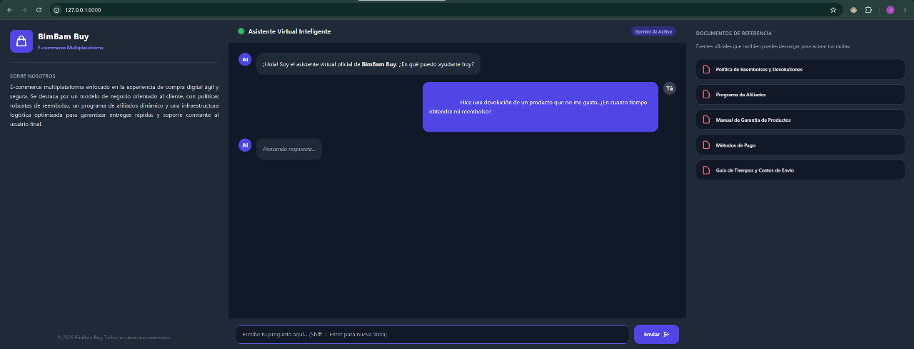
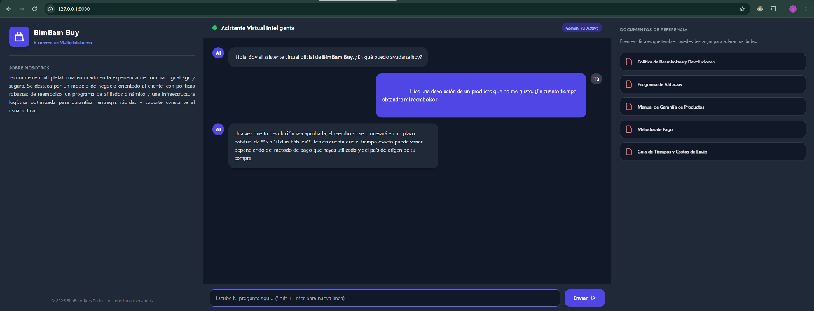
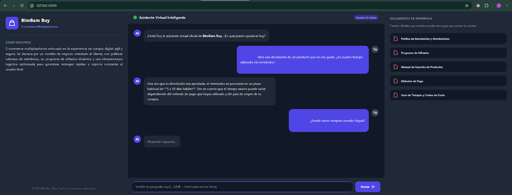

# Challenge Alura Agente

## 🔨 Funcionalidades del proyecto

En este proyecto, utilizaremos LangChain como framework principal para orquestar una solución integrada de análisis y organización de consulta de documentos empresariales en formato pdf para la respuesta a dudas de los clientes sobre sus compras en BimBam Buy que es una e-commerce multiplataforma. LangChain será empleado debido a su capacidad para conectar y gestionar flujos complejos que combinan IA multimodal y modelos de lenguaje, lo que permite un desarrollo más modular y escalable.

## ✔️ Técnicas y tecnologías utilizadas

Las técnicas y tecnologías utilizadas son:

- Programación en Python  
- Uso de la API Gemini  
- Uso del framework LangChain  
- Cadenas simples  
- Agente orquestador  
- Agente como herramientas  

## 🛠️ Abrir y configurar el proyecto

Después de descargar el proyecto, puedes abrirlo con Visual Studio Code. A continuación, es necesario preparar tu entorno. Para ello usamos la terminal cmd dentro VS Code:

### venv en Windows:

Ejecutamos los siguientes comandos en la terminal:

```bash
python -m venv .venv-gemini  --> Crea un ambiente virtual
.venv-gemini\Scripts\activate --> Activa el ambiente virtual
````

### venv en Mac/Linux:

```bash
python3 -m venv .venv-gemini
source .venv-gemini/bin/activate
```

### Instalación de paquetes

Después, instala los paquetes utilizando el siguiente comando: (se debe estar dentro del mismo directorio en que se encuentra requirements.txt):

```bash
pip install -r requirements.txt
```

### 🔑 Generar API\_KEYs y asociarlas al archivo .env

- Entra a Google AI Studio: Visita la página oficial en aistudio.google.com.
- Inicia sesión: Usa tu cuenta de Google habitual.
- Ve a la sección de API Keys: En el menú lateral izquierdo de la pantalla, haz clic en el botón que dice "Get API key" (Obtener clave de API).
- Crea la clave: Haz clic en el botón azul "Create API key".
- El sistema te preguntará si quieres asociarla a un proyecto de Google Cloud existente. Si no tienes uno, simplemente selecciona la opción para crear la clave en un nuevo proyecto (New project).
- Cópiala: Una vez que termine de cargar, aparecerá una ventana con una cadena de texto larga. Esa es tu clave
- Abrimos el archivo .env, creamos la variable y le asignamos como valor la API Key

```python
GEMINI_API_KEY = "TU_API_KEY_AQUÍ"
```

## Como ejecutar el proyecto

Este paso solo se ejecuta en caso de que en el proyecto no se encuentre la carpeta "bd_vectorial".
Teniendo almacenados los archivos pdf en una carpeta llamado resources, debemos crear la Base de Datos vectorial a la que tendra acceso el Agente, para esto, en la consola de CMD tecleamos:
```bash
python crear_bd.py
```

Ahora para poder interactuar con el agente en el modo consola y que nos responda cualquier duda con respecto a las compras en BimBam Buy, tecleamos:
```bash
python main.py
```

Si queremos interactuar con el agente mediante la aplicación web, debemos conectar el front-end (index.html) con el back-end que es nuestro agente hecho con Python. La forma más limpia y estándar es levantar un pequeño servidor web usando FastAPI. Este framework se encarga de recibir los mensajes que escribes en la página, pasárselos a tu agente de LangChain y devolver la respuesta a la pantalla.

Para esto, teclamos:
```bash
uvicorn servidor:app --reload
```

Una vez que corra, te dará un enlace local (usualmente [http://127.0.0.1:8000]). Copia ese enlace, pégalo en tu navegador web, ¡y listo! Podrás chatear visualmente con tu agente conectado directamente a tu base de datos vectorial y a la IA.

## Link del Deploy

https://challengealuraagente.onrender.com/





